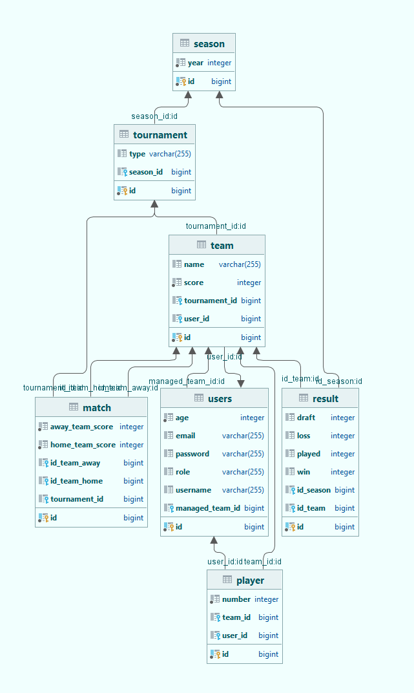
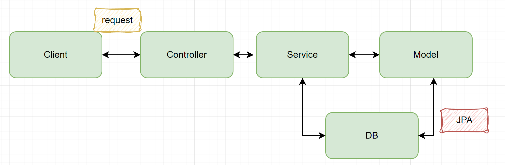
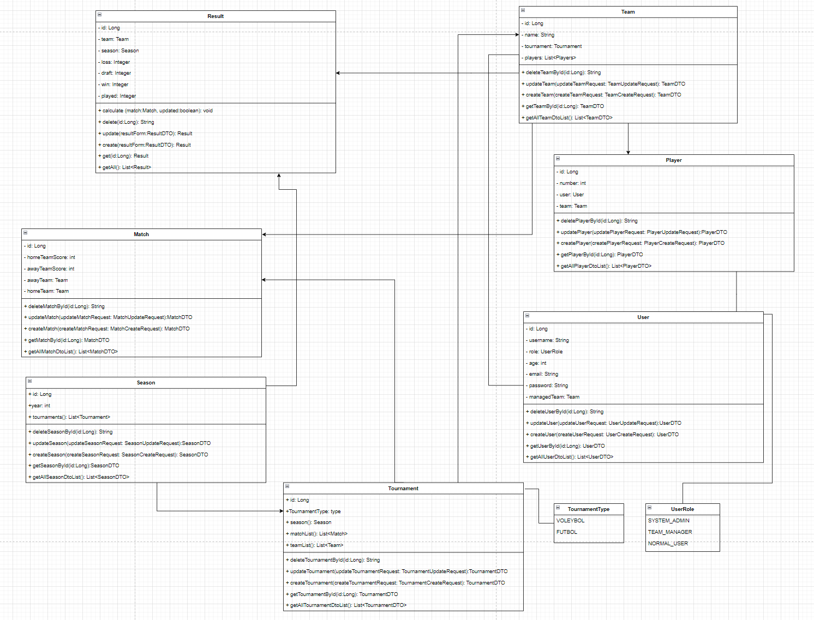
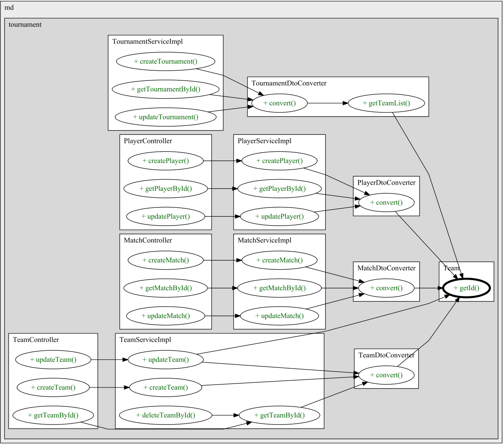
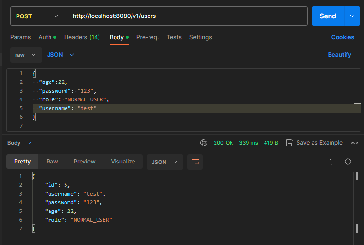
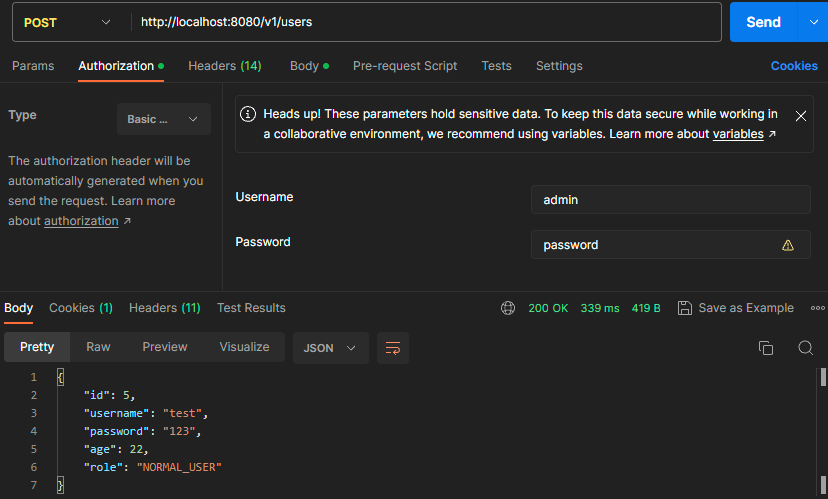
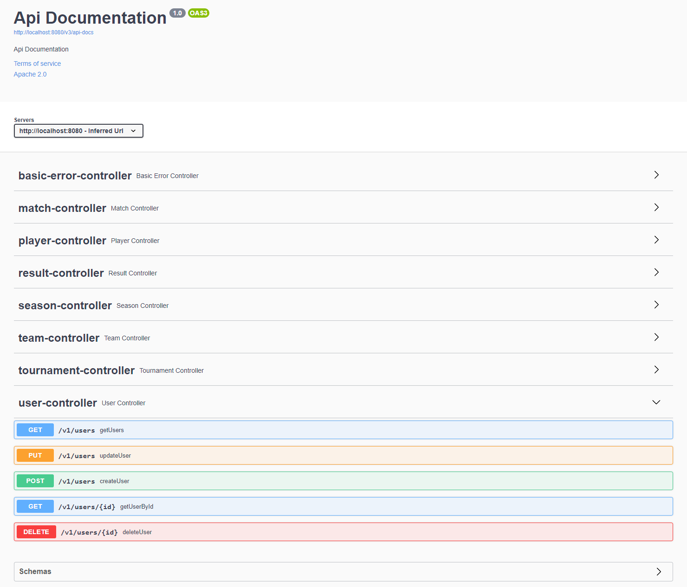
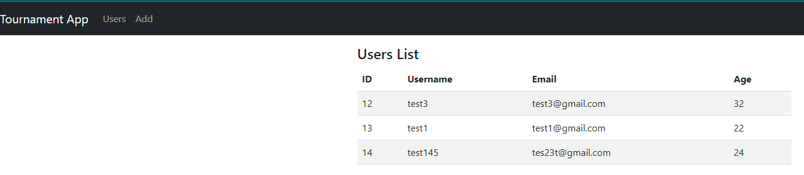

# Turnuva Projesi

Bu proje, bir turnuva yönetim sistemi oluşturmayı amaçlamaktadır. Aşağıda projeyle ilgili bazı temel bilgiler verilmiştir.

## 1. Amaç ve Kapsam
### 1.1. Amaç
Bu proje, turnuva organizasyonunu ve yönetimini kolaylaştırmayı hedeflemektedir. Sistemin kullanıcıları, turnuva oluşturma, takımları yönetme, maç programlama ve sonuçları takip etme gibi işlemleri gerçekleştirebileceklerdir.

### 1.2. Kapsam
Projenin kapsamı aşağıdaki başlıklar altında yer almaktadır:
- Turnuva oluşturma ve yönetme
- Takımları oluşturma, düzenleme ve yönetme
- Maçların programlanması ve sonuçlarının kaydedilmesi
- Sonuçları ve istatistikleri görüntüleme

## 2. Tanımlar ve Kısaltmalar
- API: Application Programming Interface
- ER: Entity-Relationship

## 3. Mimari Tasarım Kriterleri (İş Kuralları)

Proje gereksinimleri aşağıdaki iş kurallarını içermektedir:

- Turnuvalar senelik olarak düzenlenir ve turnuva tipi belirlenebilir.
- Her sene aynı tipten yalnızca bir turnuva düzenlenebilir.
- Takımların isimleri ve sorumluları kaydedilir.
- Takımlarda oyuncu sayısı ve oyuncu bilgileri belirlenebilir.
- Her takımda en fazla 30 yaş altı 3 oyuncu bulunabilir.
- Bir oyuncu yalnızca bir takımda yer alabilir.
- Takım eşleşmeleri ve skorlar girilebilir.
- Skorlara göre takım sıralaması otomatik olarak hesaplanır.
- Galibiyetler 3 puan, beraberlikler 1 puan olarak kabul edilir.

### Kullanıcı Roller ve Sorumlulukları

Proje, aşağıdaki kullanıcı rollerini desteklemektedir:

- Sistem Yöneticisi:
    - Turnuva düzenleme sorumluluğuna sahiptir.
    - Takım sorumlusu ve normal kullanıcı rollerini kapsar.
    - Takım sorumlusu veya takım oyuncusu olabilir.

- Takım Sorumlusu:
    - Sorumlu olduğu takımın as ve yedek oyuncularını belirleyebilir.
    - Normal kullanıcı rolünü kapsar.
    - Takım oyuncusu olabilir.

- Normal Kullanıcı:
    - Senelik olarak düzenlenen turnuvaları listeleyebilir.
    - Turnuvalardaki takımları ve oyuncuları listeleyebilir.
    - Takım eşleşmelerini ve skorlarını görüntüleyebilir.
    - Takım sıralamasını ve puan durumunu görüntüleyebilir.
    - Takım oyuncusu olabilir, ancak olmayabilir ve yalnızca gözlemci olarak turnuva bilgilerini görüntüleyebilir.

## 4. Genel Sistem Yapısı

Proje, "Turnuva" sistemi oluşturmayı hedeflemektedir. Aşağıda projenin genel sistem yapısı özetlenmiştir:

- Sezon, senelik olarak düzenlenen turnuvaları yönetir.
- Turnuvaların tipleri belirlenebilir ve önceden tanımlanmış olabilir.
- Takımlar turnuvalara katılabilir ve takımların sorumluları kaydedilir.
- Takımların oyuncu sayısı ve oyuncu bilgileri belirlenebilir.
- Takım eşleşmeleri ve skorlar girilebilir.
- Skorlara göre takım sıralaması otomatik olarak hesaplanır.
- Kullanıcılar sisteme farklı rollerle erişebilir: Sistem Yöneticisi, Takım Sorumlusu ve Normal Kullanıcı.
- Sistem Yöneticisi, turnuvaları düzenleme yetkisine sahiptir ve diğer rolleri kapsar.
- Takım Sorumlusu, sorumlu olduğu takımın oyuncularını belirleyebilir ve normal kullanıcı rolünü kapsar.
- Normal Kullanıcı, turnuvaları listeleyebilir, takımları ve oyuncuları görüntüleyebilir, eşleşmeleri ve skorları takip edebilir.

## 5. Mimari Görünümler

### 5.1. Yazılım Ürünleri Görünümü

Turnuva projesi kapsamında aşağıdaki yazılım ürünleri geliştirilecektir:

1. **turnuva-api**: Backend tarafını oluşturan ve temel iş mantığını içeren RESTful API. API, kullanıcıların turnuvalar, takımlar, oyuncular, eşleşmeler ve skorlar gibi verilere erişebilmesini sağlar.
2. **turnuvaweb**: Frontend tarafını oluşturan web arayüzü. Kullanıcılara turnuvaları listeleyebilme, takımları görüntüleme, eşleşmeleri ve skorları takip etme gibi işlemleri gerçekleştirme imkanı sağlar.

Ayrıca, projede hazır kullanılan bazı yazılım ürünleri de bulunmaktadır. Örnek olarak aşağıdaki kütüphaneler verilebilir:

- Spring Security: Kimlik doğrulama ve yetkilendirme işlemlerini yönetmek için kullanılır.
- Hibernate: Veritabanı işlemlerini kolaylaştırmak ve nesneleri ilişkisel veritabanına bağlamak için kullanılır.

Bu yazılım ürünleri ve araçlar, projenin işlevselliğini sağlamak ve geliştirme sürecini desteklemek için kullanılmaktadır.

### 5.2. Mimar Katman Görünümü

## 6. Görseller
### 6.1. UML

### 6.2. Uygulama akışı

### 6.3. Postman örneği
SYSTEM_ADMIN için -> kullanıcı adı : admin, şifre : password
NORMAL_USER için -> kullanıcı adı : user, şifre : password

POST, PUT, DELETE gibi istekler için SYSTEM_ADMIN rolunde olmak gerekiyor.

### 6.4. Swagger
http://localhost:8080/swagger-ui/index.html adresinden swagger'a erişilebilir.

### 6.4. Frontend
http://localhost:8081/ adresinden frontend uygulamasına ulaşılabilir.

